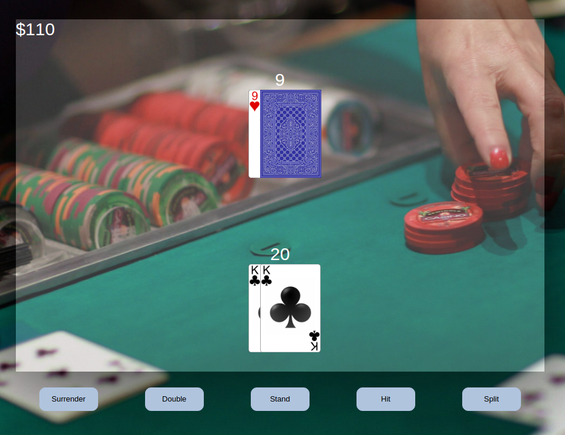
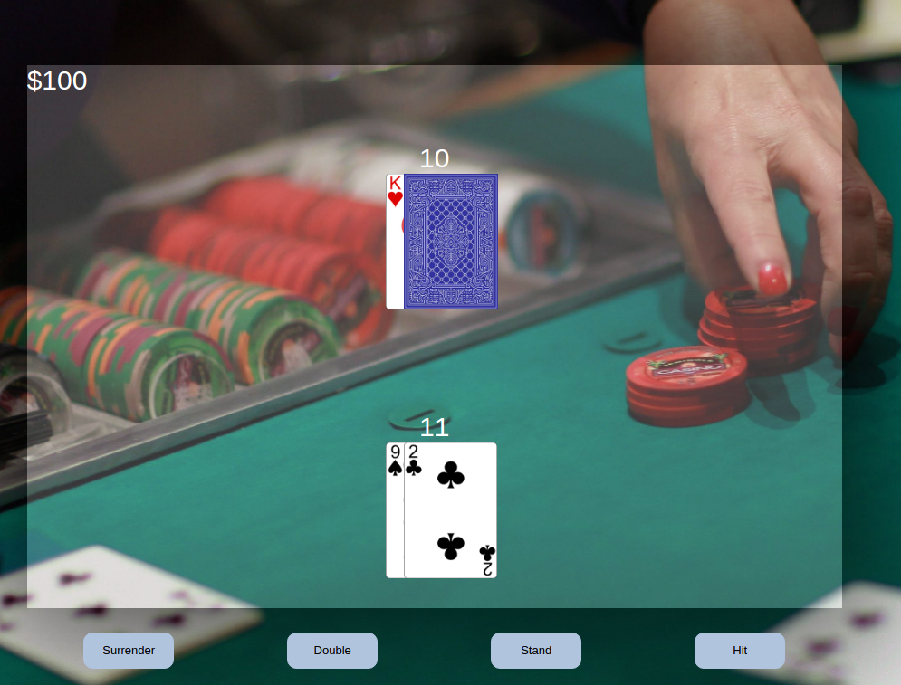
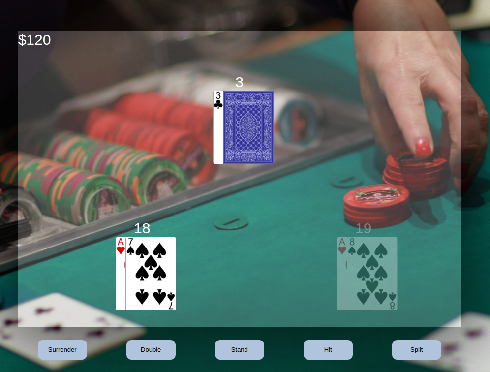

# Blackjack

[Blackjack live][github]
[github] https://bokats.github.io/smart_blackjack/

Blackjack is a version of the the popular game played in casinos all over the world. It utilizes
JavaScript for the game logic and jQuery to manipulate the front end.

This version of the game includes one maximum split, dealer has to hit soft 17, and is played with 6 decks of cards.

## Features & Implementation

The game includes all of the key features of classic Blackjack: hit, stand, split, double, and surrender. From an engineering standpoint, the game logic is separated from the views and jQuery in order to break down the game into smaller, more manageable pieces.

### Buttons

The views include dynamic functionality by only showing the buttons that are allowed for the specific set of cards. For example, if the ranks of the user cards don't match, the split button is not rendered on the screen. This is done in order to avoid actions that are disallowed and better user experience.

### Split

In addition, when a split takes place, the user gets two sets of hands, which are independently playing against the dealer. To achieve the logic of switching back and forth, the Game class has an attribute "playerHands", which an array of all the player Hands. Then each action includes logic to switch actions in the correct conditions.

Once the cards are split, I used jQuery to change the selected card and lower the opacity of the non-active hand in order to show the user which card is being played.

## Future Directions for the Project

In addition to the features already implemented, I plan to continue work on this project.  The next steps for Blackjack are outlined below.

### Advisor

Add an advisor who can tell the player the best move out of the possibilities

### Probability

Allow for probability and expected outcome calculation with visuals

### More splits && Insurance

Add up to 3 possible splits and insurance
