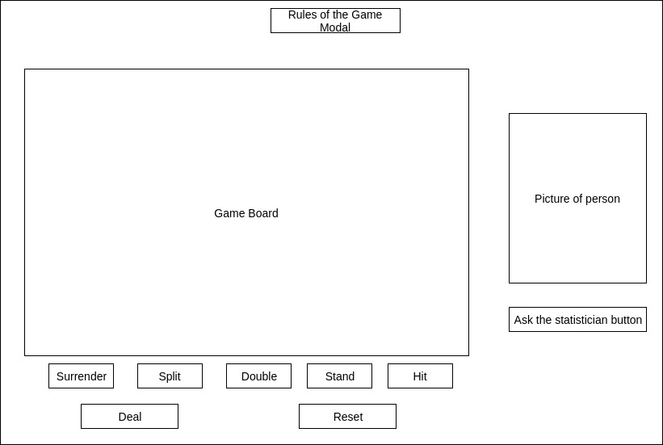

## Smart Blackjack

### Background

Blackjack is the most popular casino banking game in the world. It is
played between the dealer and a player. A player can
win in one of the following ways:

1) Get 21 points on the first two cards(blackjack)
2) Get more points than dealer without exceeding 21
3) Let dealer deal more cards until his/her hand exceeds 21

Many variations of the game exist. This project will focus on classic Blackjack
with blackjack pays 3:2 and dealer must hit soft 17.

Smart black will not only allow the player to play the game, but will also
give him/her advice on the correct moves based on the probability of success
and expected outcome for each possible move.

### Functionality & MVP

This game will have the following functionality:

- [ ] User will be able to play multiple blackjack games with all the
      functionality including: hit, stand, surrender, split, double
- [ ] User will be able to hit an Advice button that will tell him/her
      the move with the best statistical outcome
- [ ] A pop up will show up to ask the user if he/she is user before
      making the move when it is not the best one
- [ ] There will be a pot keeping track of user chips

In addition, this project will include:

- [ ] Rules of the game Modal
- [ ] A production Readme

### Wireframes

The app will consist of a game board holding all the visuals including dealer,
and current hands. All the buttons for the game will be outside of the canvas.

There will be a Rules of the game modal link higher in the page as well as
reset and start buttons under the game board.

To the right of the game console, there will be a "Ask the statistician"
option, which will tell the user the best statistical move.

### Architecture and Technologies

This project will be implemented with the following technologies:

1) Vanilla JavaScript and jQuery for overall structure and game logic
2) HTML5 Canvas to hold the visuals of the game
2) Webpack to bundle and serve up the various scripts

In addition to the webpack entry file, there will be six scripts involved in this project:

1) board.js: Holds the infomation needed to be rendered in the canvas and renders it in the canvas
2) game.js: Holds the game state and general game logic
3) deck.js, hand.js, and card.js: Hold the respective classes needed in the game
4) moves.js: This will hold all the information needed for the game to know what is the best move
  given the choices available and cards on the board

### Implementation Timeline

**Day 1**: Setup all necessary logic for blackjack.  Goals for the day:

- Set up structure of project(webpack, html)
- Have the game, deck, hand, and card classes working

**Day 2**: Learn how the canvas is going to work and render the appropriate cards. Goals of the day:

  - Set up 'board.js' file to render the appropriate information to canvas
  - Set up buttons for the game
  - There should be a functional game with minimal styling

**Day 3**: Style the canvas and buttons. Game should look good and be fully functional. Goals of the day:

  - Game should be fully functional and should look great
  - Add the "moves.js" file, statistician button and link it to the game

**Day 4**: Add the functionality for the user to be able to ask for advice on his/her move. Style the frontend, making it polished and professional.  Goals for the day:

  - Add the advice functionality
  - Have a styled `Canvas`
